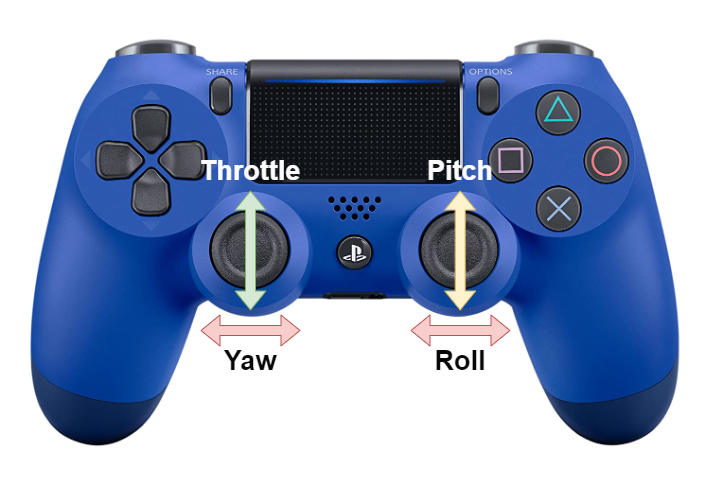
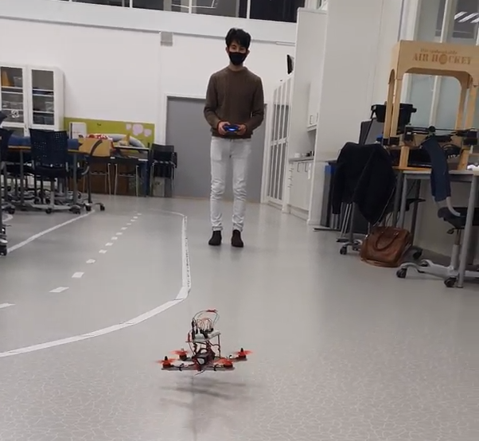

# Real-Time Systems Quadcopter
This project was made in the course Real-time systems, where the entire quadcopter was made from the scratch including the PID controller for stabilization of quadcopter.

## Components needed to build the drone
For this project we had to buy some components that were compatible with each other to make the quadcopter drone. The project main focus is to make use of the Arduino nano sense 33 BLE to make a real-time system. So Arduino will be our control unit for our entire system.

### Battery
The system uses a lithium-polymer (LiPo) battery for both powering the motors and the micro-controller. LiPo is a technology that is used to produce lightweight batteries, and it is used in weight critical systems like mobile devices and drones. The factors we had to choose were how many cells the battery should have, where each cell increases the battery operating voltage by around 3.7V. The motors we had chosen required between 2 to 3 cells (2s - 3s). The battery's capacity was based on drones with similar sized motors, which meant around 1300mAh. The motors also require a fairly high discharge rate to achieve maximum thrust. The battery we bought had a discharge rate at 25C, which gives 

$$1300mAh \cdot 25C = 32.5A$$

constant discharge rate. This also means that assuming we constantly use 32.5A, we will have a flight time of

$$ \frac{1300mAh}{32.5A} = 0.04h = 2.4 \text{ minutes,} $$

but this is dependent on many factors, such as the efficiency of the motors, how aggressive the drone will be flown, etc.

### Brushless DC Motor and Propellers
The motors were chosen based on price and how quickly we could get our hands on them. The motors we ended up with were JMT BLHeli 1806 brushless motors, with 18mm stator size and 6mm stator height. They operate at around 6.5A, which means that the battery should have a discharge rate large enough.

### Electronic Speed Controller 

An ESC is electronic circuit that acts as an interface or controller of each motor. There are many types of ESC, but for our brushless motors it requires a 3-phase ESC. These can easily be conntected direclty to our burshless motors. 

### Arduino Nano Sense 33 BLE 

For our project the important sesnors we are going to use for our project comes already installed in the Arduino, and of interest is the inertia measurement unit (IMU). The IMU or also called intertial measurement unit is used to maneuver aircrafts with the usage of accelerometers, gyroscope and sometimes the magneotmeters. The IMU has support for 3D digital linear acceleration and 3D digital angular rate measurements, which are most interesting for any drone.

### HC-12 
To support longer range communication a HC-12 433 Hz wireless radio transmitter will be used. This transmitter has a max range of around 1km, but in test in real conditions we lost much data after the drone passed 100m. The HC-12 is a half-duplex wireless serial communication we used this modules to control the drone through a controller by using two hc-12 modules.

## Remote Controller
To control the speed of each motor is done by using the joysticks on PlayStation 4 controller. To make this functional we had to use a second Arduino to communicate with Arduino nano sense 33 BLE by connecting two HC-12 module. The HC-12 is a wireless transceiver that can both transmit and receive serial information. By sending different values we can easy manipulate the roll, yaw and pitch of the quadcopter drone.

First process was to configure the controller to send the data we needed to the Arduino nano, this was done using a software called "Processing". Proccesing is open source graphical library and IDE used for art and visual design, and uses java as programming language. In processing we used a library called "Game Control Plus", and this lobar enables us to sketch out how we want the drone to be controlled by using the joysticks. The second library we used to send the serial data was the serial library that the software processing provided. This library reads and writes data to and from external devices one byte at a time. This allows both Arduinos to send and receive data, and can also communicate with microcontroller devices. The serial port exist in all computer and can be emulated through USB.

# Result
The final result of the quadcopter was not optimal in terms of design, but the main goal for this project was to make somehting that could react in real-time where we focused most  the time

